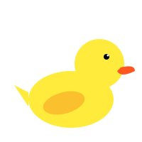
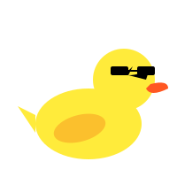

# SmartQuack 🦆

A delightful, offline-first task manager with a gamified twist! Meet your new productivity companion — a reactive duck mascot that changes its mood based on your progress.

## ✨ Features

### 🦆 Interactive Mascot

- **Mood Swings**: The duck reacts to your productivity!
  - 😴 **Sleepy**: Too many pending tasks? The duck needs a nap.
  - 😎 **Cool**: Making good progress!
  - 🎉 **Party**: All tasks done! Time to celebrate!
- **Progress Ring**: A color-changing ring tracks your daily completion percentage.

### 🚀 Production-Ready & Cloud-Synced

- **Offline-First Architecture**: Tasks are saved instantly to local storage (Hive), ensuring the app works perfectly without internet.
- **Cloud Sync**: When online, data automatically syncs to **Firebase Firestore** in the background.
- **Secure Authentication**: User accounts powered by **Firebase Auth** (Email/Password).
- **Multi-Device Support**: Log in on any device to access your tasks.

### 🎨 Gamified UI/UX

- **Streak Counter**: keep your productivity streak alive! 🔥
- **Confetti Celebration**: burst of joy when you clear your list! 🎊
- **Staggered Animations**: Smooth entry animations for task cards.
- **Smart Suggestions**: "Low energy? Start with [easiest task] first!" 💡

### 🛠 Tech Stack

- **Framework**: Flutter 3.x
- **State Management**: Riverpod 2.0 (NotifierProvider)
- **Local Database**: Hive (NoSQL)
- **Cloud Database**: Cloud Firestore
- **Authentication**: Firebase Auth
- **UI Styling**: Custom themes, Google Fonts (Fredoka, Baloo 2)

## 📦 Installation

1. **Clone the repository**:

   ```bash
   git clone https://github.com/VARA4u-tech/SmartQuack.git
   cd SmartQuack
   ```

2. **Install dependencies**:

   ```bash
   flutter pub get
   ```

3. **Firebase Setup**:
   This app uses Firebase. You must provide your own `firebase_options.dart` or configure it via CLI.
   - Install FlutterFire CLI: `dart pub global activate flutterfire_cli`
   - Configure: `flutterfire configure`

4. **Run the app**:
   ```bash
   flutter run
   ```

## 📱 Screenshots

| Dashboard                            | Add Task                                 | Duck Party                             |
| ------------------------------------ | ---------------------------------------- | -------------------------------------- |
|  |  |  |

---

Built with ❤️ by [VARA4u-tech](https://github.com/VARA4u-tech)
